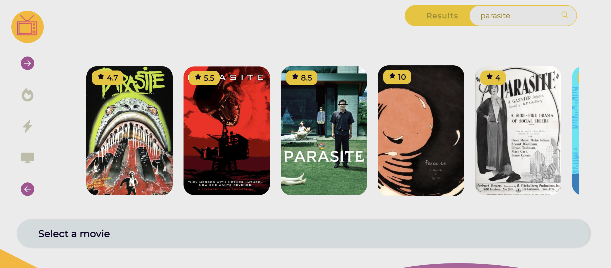

# Fav:Movies

Hello world, welcome to fav:movies app! 🎬

On this site, users will be able to:

- Search for movies
- Get movies by "popular", "top rated" or "playing now" 
- When they click on a movie they will get extra information as the title, the overview and they will get the chance to add the movie to its favorites by clicking on the heart icon.
- On the bottom side of the web, they will see a list with all the movies they have added to favorites.
- User will be able to order them by title or by votes. 
- If they click on one of their favorites movies they can see the detailed information of the movie on the middle bar and "un-favorite" them as well. 
- The design is responsive and tested on different devices. 

# UX/UI

1. First screen the users sees:

2. Search movies:

3. Select a movie -> get extra info:

 
4. But, my fav list is still empty, if we start giving some likes:

5. By default, they are sorted by title but you can display them by vote average too, or back to title sorting:

6. You can play with it from your smartphone too and still looking nice 😉:

## Try it

In the project directory, you can run:

### `npm start`

Runs the app in the development mode.\
Open [http://localhost:3000](http://localhost:3000) to view it in the browser.

## Or go LIVE! 🚀

[Fav:Movies](https://fav-movies-nine.vercel.app/)